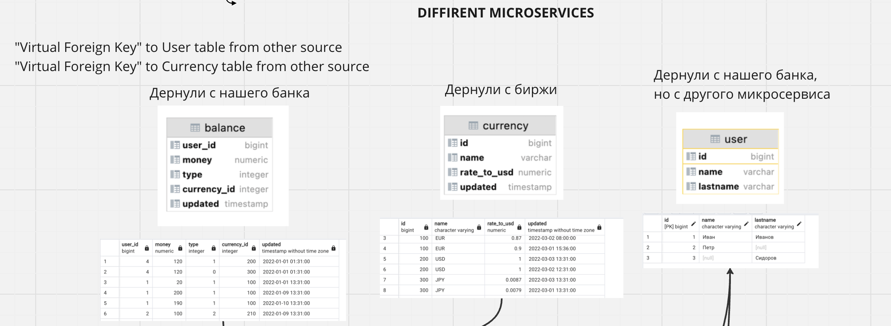
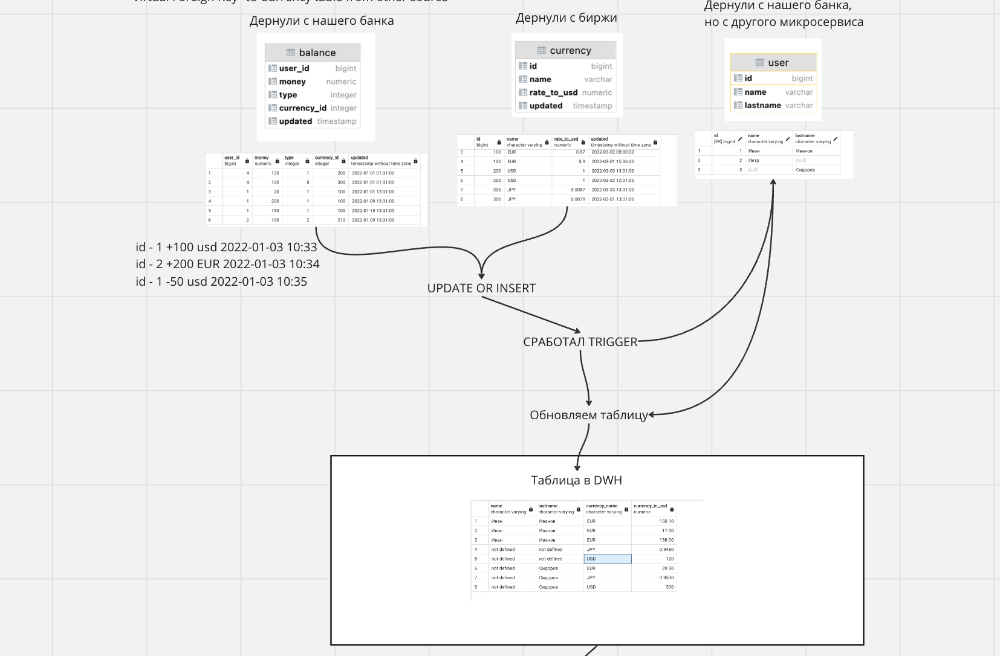
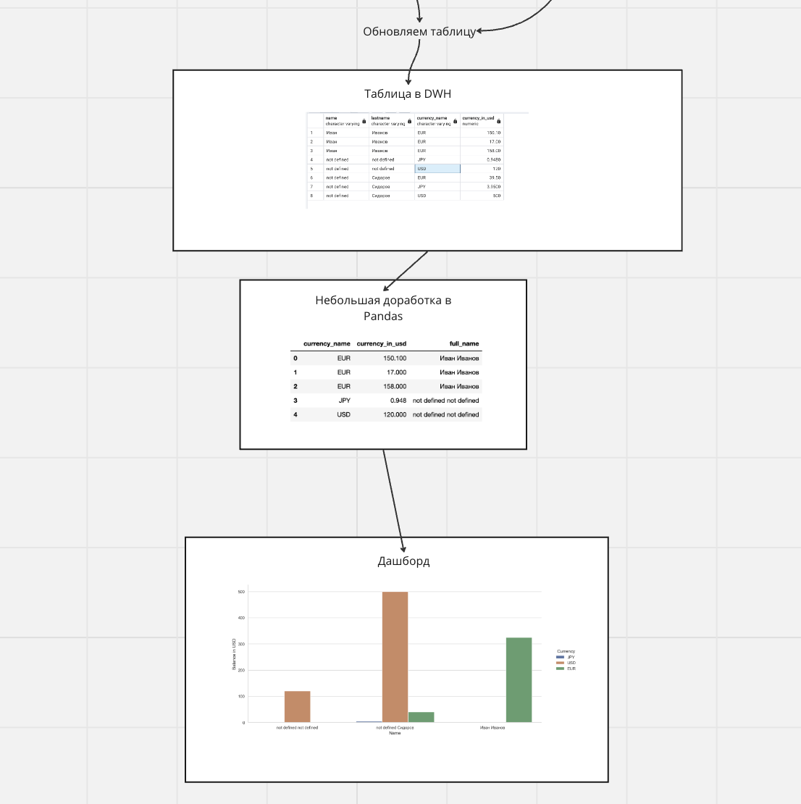

# ETL for bank with PostgreSQL

### Дисклеймер:

На момент написания этой страшной функции, я увидел SQL где-то 3-4 недели назад и для меня такая мега задача была очень сложной, но я справился.

Исходя из такого страшного Select-а, я придумал эту задачу. Она не совсем имеет смысл в проде, но мне, как крутой челлендж, было интересно такое реализовать.

## Задача:

Подготовить данные для дашборда, который будет обновляться каждое обновление баланса пользователя и будет содержать баланс каждого пользователя на момент обновления дашборда в USD.
! Если баланс пользователя в другой валюте, нам нужно найти самое ближайшее обновления курса доллара к валюте пользователя и перевести ее в USD.
! Если обновляется курс USD, мы должны так же обновить баланс пользователя в USD.
! Если у пользователя разные валюты, мы так же должны их указать как отдельную переменную.

Есть проблема, что в 3 таблицы данные дергаются из 3-ех разных источников.

Поэтому много NULL и нет общих id, либо они могут повторяться т.д.

Так же, основная функция update_current_balance является очень сложной, т.к. мы не можем джонить currency и balance. Я создал такой запрос, который берет самое ближайшее обновление курса USD к обновлению Баланса пользователя, джоинит имя, фамилию и баланс. Группирует так же по имени балансу и валюте, затем берет, например из EUR - EUR * current_rate.

Таким образом, у нас получаются актуальные балансы пользователей с суммой по всем валютам в USD. 

